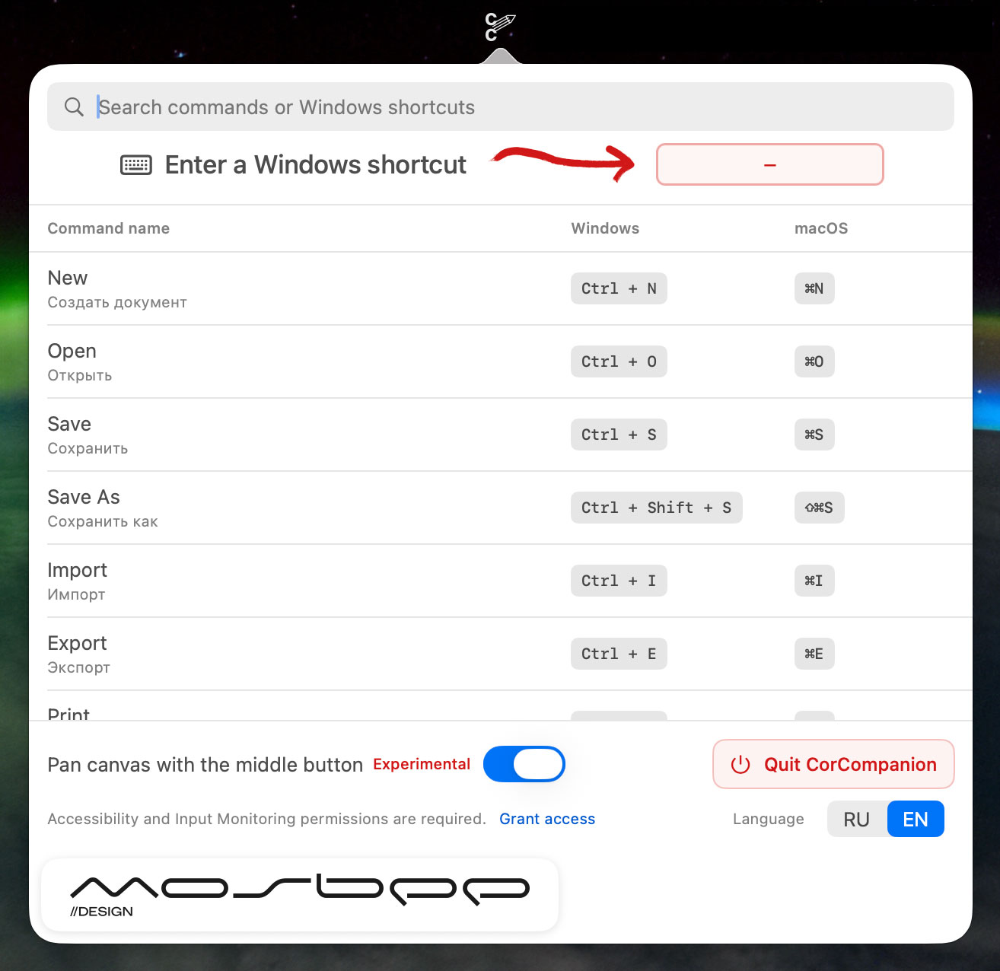

# CorCompanion

A small macOS menu bar application created for CorelDRAW users moving from Windows to Mac.

CorCompanion helps you quickly find familiar CorelDRAW keyboard shortcuts for Windows and their corresponding macOS commands. It also adds convenient document panning for standard mice with a clickable scroll wheel: use the middle mouse button to move around the CorelDRAW workspace just like in the Windows version.

I made this application for myself because, after moving from CorelDRAW for Windows to the Mac version, I constantly had to look up keyboard shortcuts and the familiar mouse panning behavior was not as convenient. Later, I decided to make it publicly available—simply because I could, and because someone else might find it useful too.

CorCompanion is free, works entirely locally and does not collect user data. It requires no account, subscription or internet connection.



> [!IMPORTANT]
> CorCompanion is an independent, unofficial project. It is not affiliated with, endorsed by or associated with Corel, Alludo or the developers of CorelDRAW.

## Features

- Search CorelDRAW commands and keyboard shortcuts in English or Russian.
- Compare familiar Windows shortcuts with their macOS equivalents.
- Record a Windows keyboard shortcut to find the matching CorelDRAW command.
- Pan the document with the middle mouse button on a standard mouse, like in CorelDRAW for Windows.
- Automatically enable CorelDRAW-specific behavior only while CorelDRAW is the active application.
- Switch the interface between English and Russian.
- Work completely offline, without analytics, accounts or network requests.

## System resource usage

CorCompanion is designed to remain lightweight while running in the background. In an idle-state measurement, it used approximately 0% CPU and 104 MB of memory. Actual memory usage may vary depending on the Mac and macOS version.

Middle-mouse-button monitoring is active only while CorelDRAW is the frontmost application, helping keep unnecessary background activity to a minimum.

## Requirements

- macOS 13 Ventura or later
- A Mac with Apple Silicon (`arm64`)
- CorelDRAW for Mac; CorelDRAW 2026 is the currently targeted version
- A mouse with a clickable scroll wheel for middle-button panning

Intel Macs are not supported by the current release build.

## Download and installation

1. Open the latest release on the GitHub **Releases** page.
2. Download `CorCompanion.dmg`.
3. Open the DMG and drag **CorCompanion** to **Applications**.
4. Launch the installed copy from `/Applications`.

The free GitHub build is not notarized by Apple. On first launch, macOS may say that it cannot verify the developer:

1. Try to open CorCompanion once.
2. Open **System Settings → Privacy & Security**.
3. Scroll to the security message about CorCompanion and click **Open Anyway**.
4. Confirm that you want to open the application.

Do not disable Gatekeeper globally.

## Middle mouse button pan

Enable **Middle-button pan** in CorCompanion to navigate a CorelDRAW document with the clickable scroll wheel, using the familiar behavior from CorelDRAW for Windows.

The feature requires **Accessibility** permission because CorCompanion needs to observe the middle mouse button and reproduce the pan gesture. Use the permission button inside the application, then enable `/Applications/CorCompanion.app` in **System Settings → Privacy & Security → Accessibility**.

Mouse events are processed locally and only while CorelDRAW is the frontmost application. The event monitor stops when another application becomes active.

Because public builds use an ad-hoc signature, installing a new version may require granting these permissions again.

## Shortcut catalogue

The included catalogue currently contains 96 searchable shortcut records. CorelDRAW shortcuts can differ between releases, workspaces and user-customized configurations, so verify an assignment inside CorelDRAW before relying on it for critical work.

The catalogue is being checked against CorelDRAW 2026 before the first public release. See [`Documentation/SHORTCUT_DATA.md`](Documentation/SHORTCUT_DATA.md) for details.

## Privacy

CorCompanion:

- does not connect to the internet;
- does not contain analytics or advertising;
- does not require an account;
- does not upload keyboard or mouse activity;
- stores only local preferences such as the selected language and pan toggle.

Keyboard capture is active only while you explicitly use the shortcut recorder. Middle-button monitoring is active only when the pan feature is enabled and CorelDRAW is frontmost.

## Verify a download

Each GitHub release includes `CorCompanion.dmg.sha256`. Place it next to the downloaded DMG and run:

```sh
shasum -a 256 -c CorCompanion.dmg.sha256
```

The result should report `CorCompanion.dmg: OK`.

## Known limitations

- The current build supports Apple Silicon only.
- The application is not notarized by Apple.
- Middle-button pan is experimental until final hands-on verification in CorelDRAW 2026 is complete.
- Shortcut assignments may vary with the selected CorelDRAW workspace or personal customization.

## Contact

- Email: [design@mosbee.ru](mailto:design@mosbee.ru)
- Telegram: [@m0sbee](https://t.me/m0sbee)

## Say thanks

If CorCompanion was useful to you and you would like to say thanks, you can leave a small tip here:

**USDT — TON network**

```text
UQCwBVllO6Wf_wBTVBPLpES-JDBgOmFSmheriXnrgKbLrH7D
```

Please make sure that the **TON network** is selected before sending. Tips are entirely optional and do not affect access to the application or any of its features.

## Development

CorCompanion is a native Swift and SwiftUI application distributed as a Swift Package.

1. Install the current stable version of Xcode.
2. Open `Package.swift`.
3. Select the `CorelCompanion` executable scheme.
4. Build and run the application.

Run the automated tests with:

```sh
swift test
```

Release builds support Apple Silicon and macOS 13 or later. Update the version in `Config/BuildSettings.env`, then generate the GitHub release artifacts with:

```sh
scripts/build-github-release.sh
```

Architecture and packaging details are available in [`Documentation/ARCHITECTURE.md`](Documentation/ARCHITECTURE.md) and [`Documentation/RELEASE.md`](Documentation/RELEASE.md).

> **P.S.** This application was developed entirely with ChatGPT, and all of this text was written by it too. I merely sat there blinking, because designers have paws.

## Trademark notice

Corel, CorelDRAW and related names and logos are trademarks of their respective owners. Their use here is solely to describe compatibility and the application’s intended purpose. CorCompanion is not affiliated with, endorsed by or sponsored by Corel or Alludo.
